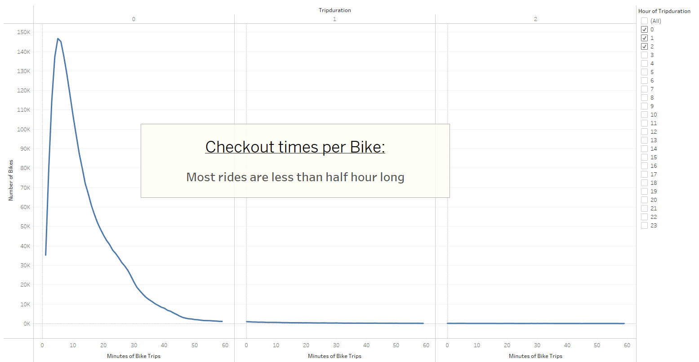
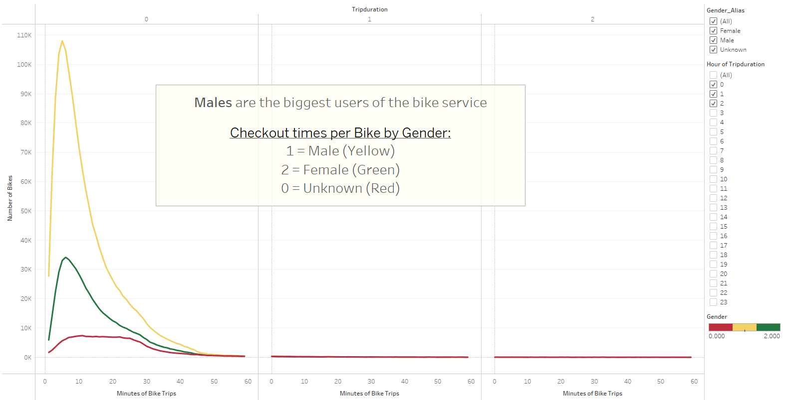
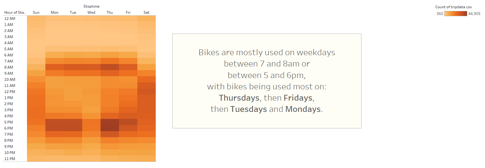
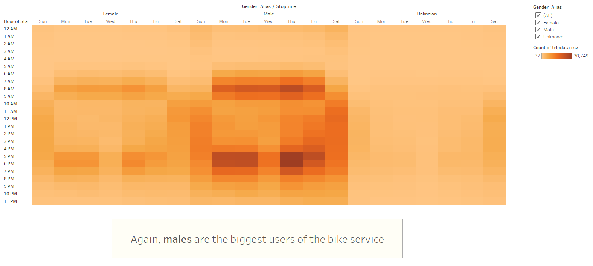
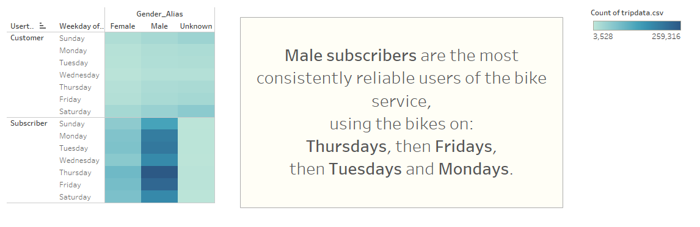
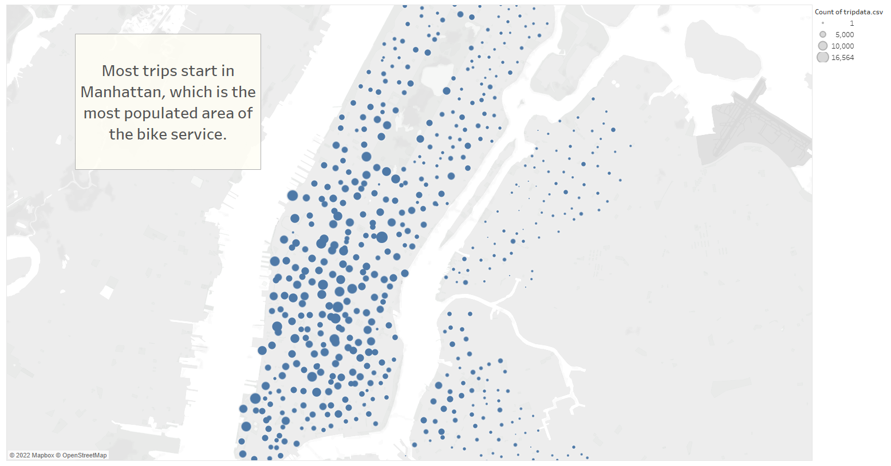
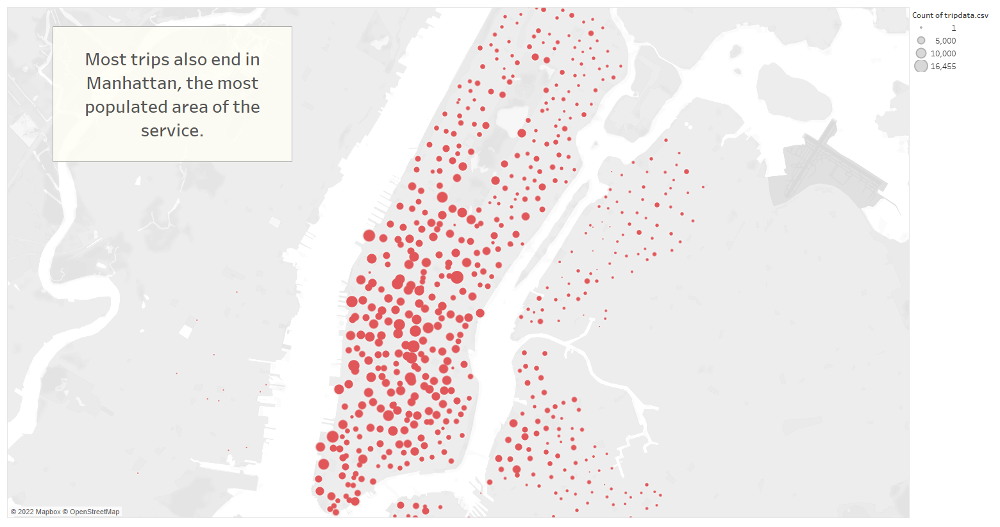

# Bike Sharing Service

The purpose of this project is to convince investors that a bike-sharing program in Des Moines is a solid business proposal. To solidify the proposal, one of the key stakeholders would like to see a bike trip analysis. For this analysis, Pandas is used to change the "tripduration" column from an integer to a datetime datatype. Then, using the converted datatype, a set of visualizations is created in Tableau to illustrate and visualise:

- The length of time that bikes are checked out for all riders and genders
- The number of bike trips for all riders and genders for each hour of each day of the week
- The number of bike trips for each type of user and gender for each day of the week
- Two visualizations showing geographic locations of bike trip starts and trip ending locations

## Executive Summary:
Based on findings from the data as illustrated below, top takeaways to create a successful bike program in De Moines are:

- Advertising to target men as the main demographic
- Positioned the bikes in the most populated areas
- Offer incentives for use during high commute hours

### Tableau Story can be found in the following link:
https://public.tableau.com/app/profile/derya.m.ferendeci/viz/CitiBikeAnalysis_16451377096080/TheStory?publish=yes

## Checkout Times for All Users:

## Checkout Times by Gender:

## Trips by Weekday for Each Hour:

## Trips by Gender per Weekday per Hour:

## User Trips by Gender by Weekday:

## Bike Trip Starts Greater NYC:

## Bike Trip Ending Locations for Greater NYC:

